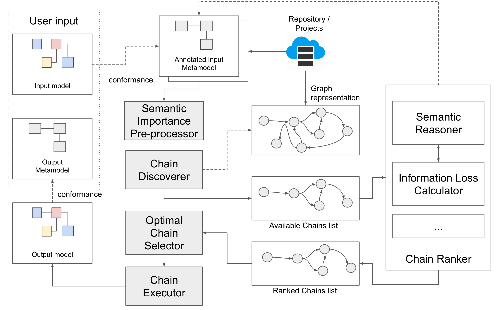
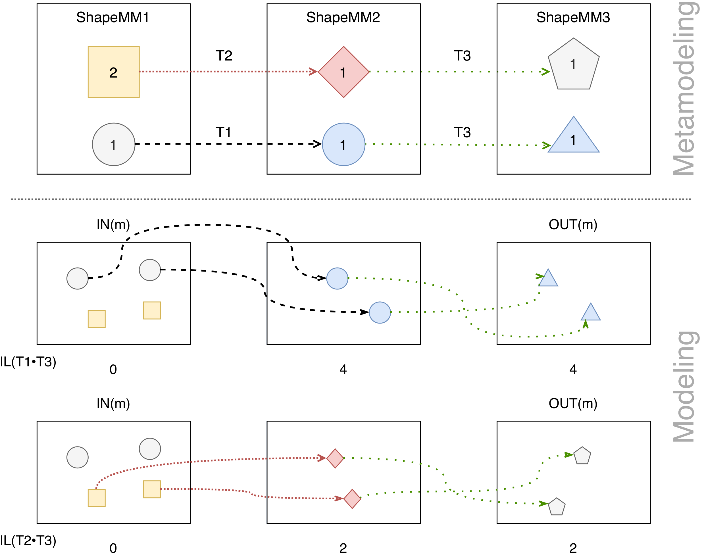

# HIDDENTOOL 

The presented tool offered a first level of customization on the meta-metamodel level, specifying the weight of the information loss wrt. the concept of a lost instance or a lost value set in a structural feature. This means that for every instance lost in the transformation process, the tool will consider the same weight. 
In this work we extend the definition of information loss with the notion of _semantic importance_ to be expressed on the concepts in metamodels involved in the transformation. Moreover the tool HIDDENTOOL presented in <cite>[[1]](#ref1)</cite> has been extended with a semantic reasoner component that will automatically select the solution with minor information loss, also considering the semantic importance. We enhanced HIDDENTOOL with a "+" entitling it HIDDENTOOL+.

In this section we will describe the approach implemented by the tool for selecting optimal transformation chains based on information loss and semantic importance. 
HIDDENTOOL works as an integration of the MDEForge <cite>[[2]](#ref2)</cite>, but it can work also as standalone plugin. Indeed to run the tool in a standalone environment, as we will demonstrate later, are only related to the remote connection with the repository, used to retrieve the required models and transformations. 
The Figure below shows the main architecture of the tool with the components and the different kinds of artefacts given as input or generated in output. The user request is composed of an input model and a required output metamodel. The input model is given to a dedicated component, which is able to retrieve the corresponding metamodel, that the modeler can edit in order to express the _semantic importance_ of the concepts and relationships. 


 <em>Proposed tool.</em>
 
## Running example

In this section we are going to explore a running example based on three metamodels, i.e. __ShapeMM1__, __ShapeMM2__ and __ShapeMM3__ part of a project where three transformations are possible, i.e. __T1, T2, T3__, as depicted in Figure below.


<em>Semantic Importance-based Information Loss.</em>

## Execution on Real Examples

We show the results of executing the tool first with the project shown as running example, and then with other 4 projects, downloaded from the ATL Zoo.
[Table](#table1) reports the name of the project, the available chains if more than one available and the selected chain by the approach. Also the available transformations can be found on this github repository ([case study folder](tool/case_study)). The annotations in the metamodel elements are reported randomly in order to check the effectiveness of the approach.
The result is then reported in terms of IL if the approach is able to identify the best chain wrt. the input model and the semantically annotated metamodel on the input model.

<a id="table1"></a>
| Projects  |  Available chains |  Selected |  IL |
|  :---:       |:---:|:---:|:---:|
| [Shapes](wiki/shape.md)       | T1 --> T3 <hr/> T2 --> T3  | T2 --> T3  | 1.73 <hr/> **1.07**  |
| [Grafcet2PNML](wiki/grafcet.md) | Grafcet2PetriNet --> PetriNet2PNML v1.0 <hr/> Grafcet2PetriNet --> PetriNet2PNML v1.87 | Grafcet --> PetriNet --> PNML v1.0 | **0.40** <hr/> 2.40 |
| [Table2XML](wiki/table.md)    | Table2HTML --> HTML2XML v1.0 <hr/> Table2HTML --> HTML2XML v1.6  | Table2HTML --> HTML2XML v1.0  | **0** <hr/> 456  |
| [Ant2XML](wiki/ant.md)      | ANT2Maven --> Maven2XML v1.0 <hr/> ANT2Maven --> Maven2XML v1.01  | ANT2Maven --> Maven2XML v1.0 | **0** <hr/> 62.59  |
| [PathExp2XML](wiki/path.md)     | PathExp2PetriNet -> PetriNet2XML v0.6 <hr/> PathExp2PetriNet -> PetriNet2XML v0.9 | PathExp2PetriNet -> PetriNet2XML v0.9  | 3.0 <hr/> **0**  |

<em>Result of the execution on different projects.</em>

### Getting started with HIDDENTOOL+

HIDDENTOOL+ is provided as a maven project, which can be run within ECLIPSE IDE. 

  1. clone this repository and then point to the tool folder 
  ``` git clone https://github.com/MDEGroup/CITRICplus && cd CITRICplus/tool```
  2. install all maven dependencies
  ```mvn install```
  3. import the source code in ECLIPSE as an ```Existing maven project```
  4. use the provided launch files to execute different case studies as you prefer.
  
HIDDENTOOL+ computes transformation chaining at runtime, without generetating middle models. For example, to compute the best chain between T1 --> T3, and T2 --> T3 HIDDENTOOL+ does not build the model conforming to the ShapeMM2 metamodel.
Result of our case studies are listed in [Table 1](#table1).

### References

<a id="ref1"></a>[1] A tool for automatically selecting optimal model transformation chains. Basciani, Francesco and Di Ruscio, Davide and D'Emidio, Mattia and Frigioni, Daniele and Pierantonio, Alfonso and Iovino, Ludovico. Proceedings of the 21st ACM/IEEE International Conference on Model Driven Engineering Languages and Systems: Companion Proceedings. [url](https://doi.org/10.1145/3270112.3270123).

<a id="ref2"></a>[2] MDEForge: an Extensible Web-Based Modeling Platform. Francesco Basciani, Juri Di Rocco, Davide Di Ruscio, Amleto Di Salle, Ludovico Iovino, Alfonso Pierantonio. Proceedings of the 2nd International Workshop on Model-Driven Engineering on and for the Cloud co-located with the 17th International Conference on Model Driven Engineering Languages and Systems. [url](http://ceur-ws.org/Vol-1242/paper10.pdf)
